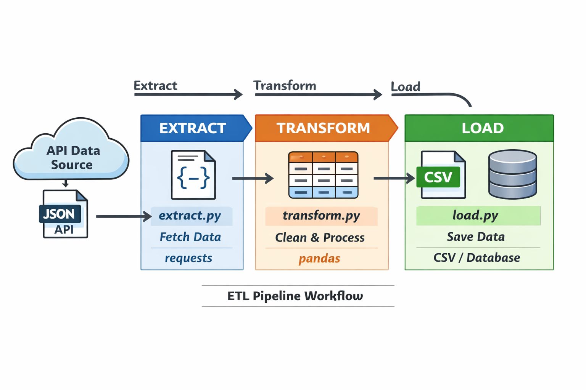
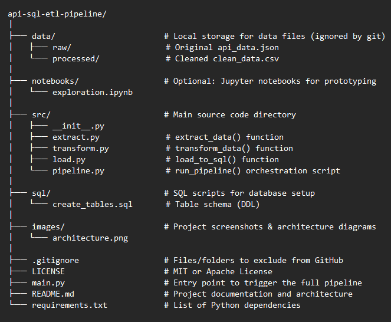

# API-Data-Source-ETL-Pipeline-Using-Python-and-SQL
A complete ETL (Extract, Transform, Load) pipeline that automates the flow of data from a REST API into a Microsoft SQL Server database. This project demonstrates modern data engineering practices including JSON flattening, data validation, and automated schema mapping.

## Project Architecture
The pipeline follows a standard ETL pattern, moving data through three distinct stages:

1.  **Extract**: Connects to the REST API using the `Requests` library to pull raw JSON data.
2.  **Transform**: Utilizes `Pandas` for data cleaning, flattening nested structures, and engineering new features.
3.  **Load**: Uses `SQLAlchemy` and `PyODBC` to securely push the final structured dataset into a SQL Server database.
*Note: This pipeline focuses on Stages 1 and 2 of the architecture: Data Acquisition and ETL Processing.*

## Features

* Extraction: Fetches live user data from the JSONPlaceholder API.
* Transformation:
   * Flattens nested JSON objects into a relational format using Pandas.
   * Data Cleaning: Standardizes text (Title Case), handles missing values, and enforces data      types.
   * Feature Engineering: Generates new insights like email_domain, name_length, and
     location_company strings.
* Loading: Automates data insertion into SQL Server using SQLAlchemy with optimized chunk loading.
* Error Handling: Robust pipeline monitoring with informative console logging.

## Project Structure

## Tech Stack

* Language: Python 3.x
* Libraries: Pandas, Requests, SQLAlchemy, PyODBC
* Database: Microsoft SQL Server (Express/Developer)
* Driver: ODBC Driver 17 for SQL Server

## Prerequisites
Before running the pipeline, ensure you have the following installed:

   1. Python 3.8+
   2. Microsoft ODBC Driver 17
   3. A SQL Server instance with a database named ETL_DB.

## Database Setup
Before running the pipeline, execute the SQL script located at `sql/create_tables.sql` in your SQL Server Management Studio (SSMS). This will:
   1. Create the `ETL_DB` database.
   2. Define the `Users` table with correct data types for engineered features.

## Usage

   1. Clone the repository:
   
   git clone https://github.com
   
   2. Install dependencies:
   
   pip install pandas sqlalchemy pyodbc requests
   
   3. Run the pipeline:
   
   python main.py

